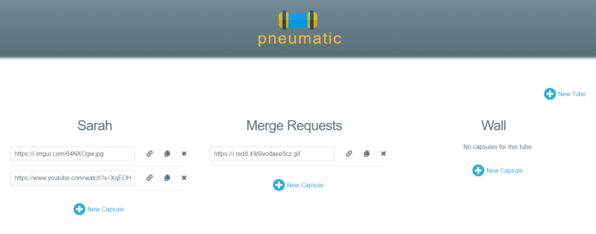

# Pneumatic

I find myself trying to store links often that I want to share with others at a later time. This app easily stores the links for later retrieval.

## Tubes and Capsules

A tube is a queue that stores your individual links (capsules). Create a tube that is used to send to one person or for one purpose and fill it up with as many capsules as you need to. The capsules are stored in a FIFO queue (although you can copy and delete from anywhere). 

## Todo

* Add user accounts
* Finish implementing clipboard.js
* Mobile friendly
* YouTube previews
